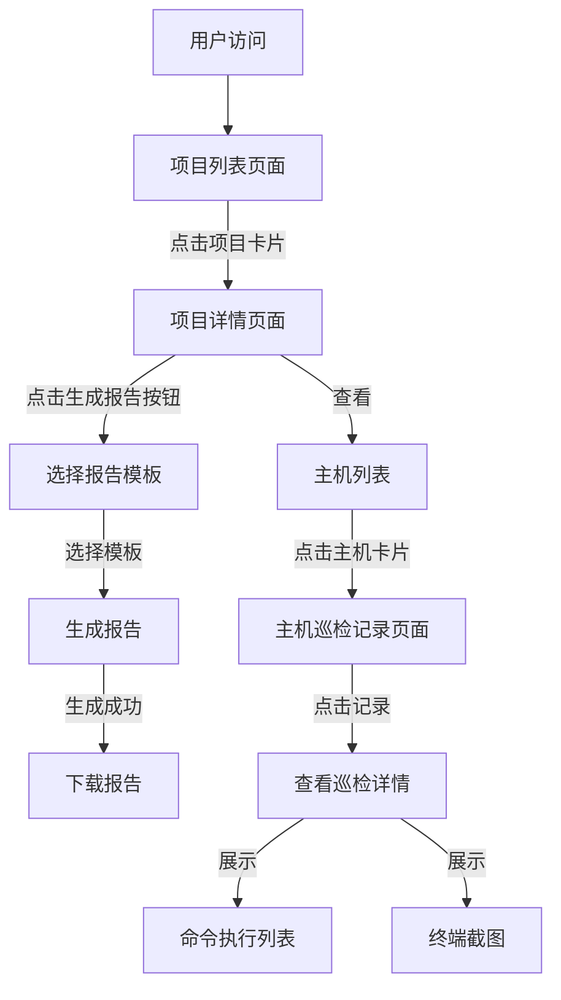
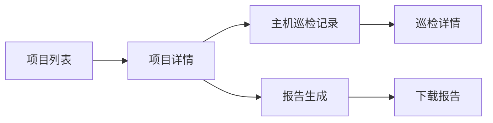
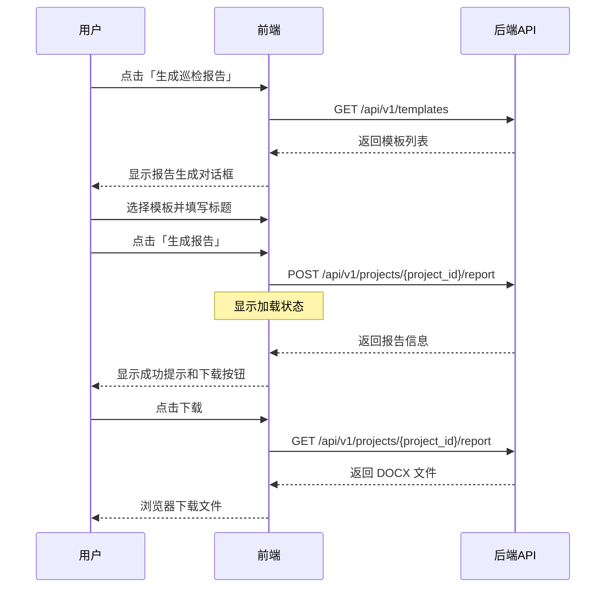
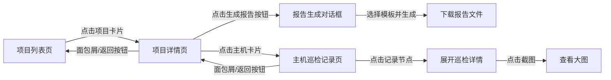
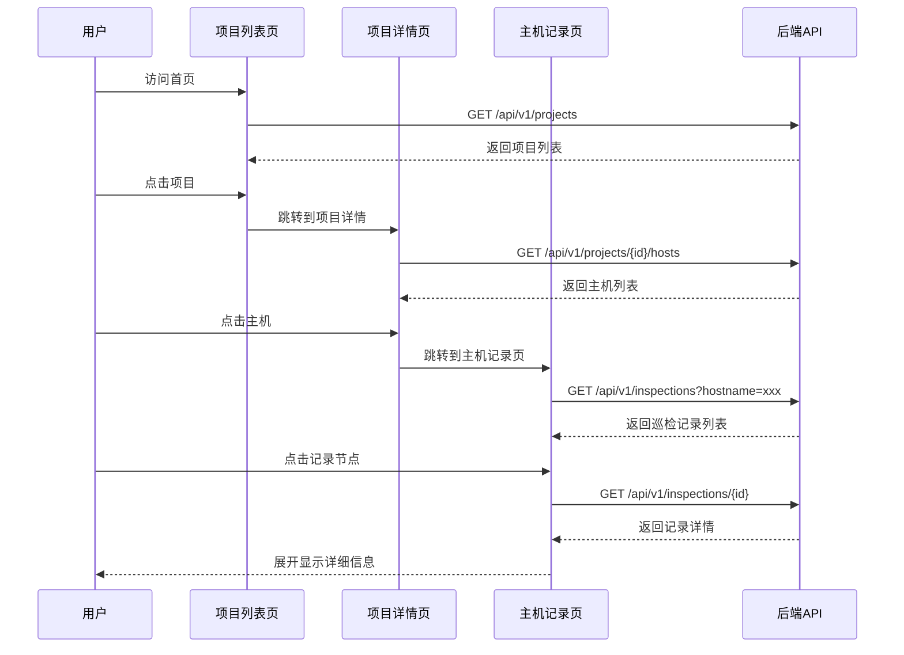

# Web 前端设计方案

## 项目概述

为服务器巡检报告系统设计一个简洁实用的 Web 界面,核心功能是通过「项目 → 主机 → 巡检记录」的三层导航结构查看巡检数据,并支持在项目页面生成和下载不同样式的巡检报告。

## 核心需求

1. 项目列表页面:展示所有项目,点击进入项目详情
2. 项目详情页面:展示该项目下的所有主机,点击主机查看巡检记录
3. 主机巡检记录页面:展示该主机的所有巡检历史记录及详细信息
4. 报告生成功能:在项目详情页提供报告生成按钮,支持选择报告模板样式
5. 无需登录:直接访问即可使用所有功能

## 设计目标

| 目标维度 | 描述 |
|---------|------|
| 简洁易用 | 三层导航结构清晰,操作流程简单直观 |
| 信息层次 | 从项目到主机到记录,逐层深入展示数据 |
| 报告便捷 | 一键生成报告,支持多种模板样式选择 |
| 响应式设计 | 适配桌面端和平板设备 |
| 快速访问 | 无登录流程,打开即用 |

## 技术选型建议

| 技术层 | 推荐方案 | 理由 |
|--------|---------|------|
| 前端框架 | Vue 3 或 React | 组件化开发,生态成熟 |
| UI 组件库 | Element Plus (Vue) 或 Ant Design (React) | 提供丰富的企业级组件 |
| 状态管理 | Pinia (Vue) 或 Zustand (React) | 轻量级状态管理 |
| 路由 | Vue Router 或 React Router | 单页应用导航 |
| HTTP 客户端 | Axios | 简洁的 API 封装 |
| 打包工具 | Vite | 快速的开发体验 |

## 整体架构设计

### 应用结构

```
web-frontend/
├── src/
│   ├── components/          # 通用组件
│   │   ├── ProjectCard.vue  # 项目卡片
│   │   ├── HostCard.vue     # 主机卡片
│   │   └── InspectionTimeline.vue  # 巡检时间线
│   ├── views/               # 页面视图
│   │   ├── ProjectList.vue  # 项目列表页
│   │   ├── ProjectDetail.vue  # 项目详情页
│   │   └── HostInspections.vue  # 主机巡检记录页
│   ├── api/                 # API 接口封装
│   │   ├── request.js       # Axios 实例配置
│   │   ├── project.js       # 项目相关接口
│   │   ├── inspection.js    # 巡检相关接口
│   │   ├── report.js        # 报告相关接口
│   │   └── template.js      # 模板相关接口
│   ├── stores/              # 状态管理(可选)
│   ├── router/              # 路由配置
│   │   └── index.js
│   ├── utils/               # 工具函数
│   │   ├── date.js          # 日期格式化
│   │   └── format.js        # 数据格式化
│   ├── App.vue              # 根组件
│   └── main.js              # 入口文件
├── public/                  # 公共资源
├── package.json
└── vite.config.js
```

### 核心导航流程



### 页面层级关系



## 功能模块设计

### 1. 页面布局

#### 顶部导航栏

| 元素 | 位置 | 功能 |
|------|------|------|
| 应用名称和 Logo | 左侧 | 显示「服务器巡检报告系统」,点击返回项目列表 |
| 面包屑导航 | 中间 | 显示当前位置(如:项目列表 / 项目A / 主机B) |
| 系统信息 | 右侧 | 显示项目总数、主机总数 |

#### 内容布局

采用单页内容区域,无侧边栏,保持界面简洁:
- 顶部导航栏固定
- 面包屑导航辅助定位
- 主内容区域展示当前页面内容
- 底部显示版权信息

### 2. 项目列表页面(首页)

这是用户访问系统后看到的第一个页面,也是整个系统的入口。

#### 页面顶部

| 区域 | 内容 |
|------|------|
| 页面标题 | 「项目列表」 |
| 统计信息栏 | 显示项目总数、主机总数、最近巡检时间 |

数据来源:GET /api/v1/stats

#### 项目卡片网格

以卡片形式展示所有项目,采用响应式网格布局:
- 桌面端:每行 3-4 个卡片
- 平板端:每行 2 个卡片

#### 项目卡片设计

每个项目卡片包含:

| 元素 | 内容 | 样式 |
|------|------|------|
| 项目图标 | 文件夹图标或自定义图标 | 顶部居中 |
| 项目代码 | project_code | 粗体,主标题 |
| 项目名称 | project_name | 副标题 |
| 项目描述 | description | 灰色文字,最多显示 2 行,超出省略 |
| 统计信息 | 主机数量、最新巡检时间 | 小号文字,底部展示 |
| 状态标签 | 活跃/归档 | 右上角标签 |

交互行为:
- 鼠标悬停:卡片阴影加深,轻微上浮效果
- 点击卡片:跳转到项目详情页面

数据来源:GET /api/v1/projects

#### 空状态处理

如果没有项目数据,显示:
- 空状态图标
- 提示文字:「暂无项目数据,请通过 API 提交巡检数据」

### 3. 项目详情页面

点击项目卡片后进入该页面,展示项目的主机列表和报告生成功能。

#### 面包屑导航

显示:项目列表 > 项目名称

#### 项目信息区域

| 区块 | 内容 |
|------|------|
| 项目标题 | 项目名称(大标题) + 项目代码(副标题) |
| 项目描述 | 完整的项目描述文字 |
| 统计卡片 | 主机数量、总巡检次数、最新巡检时间 |

数据来源:GET /api/v1/projects/by-code/{project_code} 或 GET /api/v1/projects/{id}/statistics

#### 操作按钮区

| 按钮 | 样式 | 功能 |
|------|------|------|
| 生成巡检报告 | 主要按钮(蓝色) | 打开报告生成对话框 |

位置:项目信息区域右上角

#### 主机列表区域

标题:「主机列表(共 X 台)」

以卡片形式展示该项目下的所有主机,采用网格布局。

数据来源:GET /api/v1/projects/{project_id}/hosts

#### 主机卡片设计

每个主机卡片包含:

| 元素 | 内容 | 说明 |
|------|------|------|
| 主机图标 | 服务器图标 | 区分 Linux/Windows 等 |
| 主机名 | hostname | 主标题,粗体 |
| IP 地址 | ip | 副标题 |
| 系统信息 | OS + 内核版本 | 小字,灰色 |
| 架构 | arch | 标签形式(如 x86_64) |
| 最新巡检时间 | timestamp | 相对时间(如:2 小时前) |
| 巡检次数 | 统计数据 | 显示该主机的历史巡检次数 |

交互行为:
- 鼠标悬停:卡片高亮
- 点击卡片:跳转到该主机的巡检记录页面

#### 报告生成对话框

点击「生成巡检报告」按钮后弹出的对话框。

对话框标题:「生成项目巡检报告」

对话框内容:

| 步骤 | 内容 |
|------|------|
| 项目信息确认 | 显示项目名称、主机数量(只读) |
| 选择报告模板 | 单选按钮组,列出所有可用模板 |
| 报告标题 | 文本输入框,可自定义,默认值为「服务器巡检报告 - {项目名称}」 |

#### 模板选择区域

以单选卡片形式展示模板列表:

| 模板信息 | 展示内容 |
|----------|----------|
| 模板名称 | 如「标准模板」「简化模板」「纯截图模板」 |
| 模板描述 | 简短说明模板特点 |
| 默认标签 | 如果是默认模板,显示「推荐」标签 |
| 配置预览 | 图标显示是否包含返回码、输出、截图 |

数据来源:GET /api/v1/templates

对话框按钮:
- 取消:关闭对话框
- 生成报告:提交生成请求

#### 报告生成流程



生成成功后:
- 关闭对话框
- 显示成功消息提示
- 提供「立即下载」按钮

### 4. 主机巡检记录页面

点击主机卡片后进入该页面,展示该主机的所有历史巡检记录。

#### 面包屑导航

显示:项目列表 > 项目名称 > 主机名称

#### 主机信息区域

顶部展示主机的基本信息卡片:

| 信息项 | 数据来源 |
|--------|----------|
| 主机名 | hostname |
| IP 地址 | ip |
| 操作系统 | os |
| 内核版本 | kernel |
| 系统架构 | arch |
| 项目归属 | project_id |
| 巡检总次数 | 统计该主机的记录数 |

#### 巡检记录时间线

以时间线形式展示该主机的所有巡检记录,按时间倒序排列(最新的在最上面)。

数据来源:GET /api/v1/inspections?hostname={hostname}&project_id={project_id}&sort_by=timestamp&sort_order=desc

#### 时间线节点设计

每个时间线节点代表一次巡检记录:

| 元素 | 内容 |
|------|------|
| 时间戳 | 巡检时间(精确到秒) |
| 状态图标 | 成功(绿色勾)或失败(红色叉) |
| 记录摘要 | 命令数量、是否有截图 |
| 展开按钮 | 点击展开查看详细信息 |

交互行为:
- 默认折叠状态,只显示时间和摘要
- 点击节点或展开按钮,展开显示完整的巡检详情
- 最新的一条记录默认展开

#### 巡检详情展开区域

展开后显示该次巡检的完整信息:

##### 基本信息表格

| 字段 | 显示内容 |
|------|----------|
| 记录 ID | id |
| 巡检时间 | timestamp(完整格式) |
| 状态 | status |
| 备注 | notes(如果有) |

##### 环境变量(可折叠)

以表格形式展示 env_data:

| 列名 | 内容 |
|------|------|
| 变量名 | 环境变量 key |
| 变量值 | 环境变量 value |

##### 命令执行列表

每个命令以卡片形式展示:

| 卡片区域 | 内容 |
|----------|------|
| 命令标题 | 命令字符串(等宽字体) |
| 返回码 | 返回码数值,0 为绿色,非 0 为红色 |
| 执行结果 | 命令输出文本(等宽字体,浅色背景) |
| 终端截图 | 如果有截图路径,显示截图图片 |

截图展示方式:
- 默认显示缩略图(最大宽度 800px)
- 点击图片弹出大图预览(支持缩放)
- 提供下载截图按钮

数据来源:GET /api/v1/inspections/{id}

#### 空状态处理

如果该主机没有巡检记录:
- 显示空状态图标
- 提示文字:「该主机暂无巡检记录」

### 5. 通用交互设计

#### 消息提示

| 场景 | 提示类型 | 持续时间 |
|------|----------|----------|
| 操作成功 | 成功消息(绿色) | 3 秒 |
| 操作失败 | 错误消息(红色) | 5 秒 |
| 警告提示 | 警告消息(黄色) | 4 秒 |
| 信息通知 | 信息消息(蓝色) | 3 秒 |

#### 加载状态

| 场景 | 加载表现 |
|------|----------|
| 页面初始化 | 页面中心加载动画 |
| 数据加载 | 卡片骨架屏或加载提示 |
| 提交表单 | 按钮加载状态 |
| 生成报告 | 进度条或加载动画 |

#### 错误处理

| 错误类型 | 处理方式 |
|----------|----------|
| 网络错误 | 显示错误消息,提供重试按钮 |
| 404 错误 | 显示「资源不存在」提示 |
| 500 错误 | 显示「服务器错误」提示 |
| 数据为空 | 显示空状态图标和说明文字 |

#### 返回上一级按钮

在项目详情页和主机巡检记录页,除了面包屑导航外,还提供「返回」按钮:
- 位置:页面左上角,标题旁边
- 图标:左箭头
- 文字:「返回」
- 功能:返回上一级页面

## API 接口封装

### 接口层设计

统一的请求拦截器:
- 添加基础 URL(从环境变量读取)
- 添加请求超时设置
- 添加请求头(Content-Type 等)

统一的响应拦截器:
- 处理响应数据格式
- 统一错误处理
- 提取业务数据

### 接口模块划分

| 模块文件 | 包含的接口 |
|----------|------------|
| project.js | 项目查询、统计、主机列表 |
| inspection.js | 巡检记录查询、详情 |
| report.js | 生成报告、下载报告 |
| template.js | 模板列表查询 |
| stats.js | 系统统计 |

### 关键接口列表

| 功能 | 接口 | 方法 | 说明 |
|------|------|------|------|
| 获取系统统计 | /api/v1/stats | GET | 首页统计信息 |
| 获取项目列表 | /api/v1/projects | GET | 项目列表页 |
| 获取项目主机 | /api/v1/projects/{id}/hosts | GET | 项目详情页 |
| 获取项目统计 | /api/v1/projects/{id}/statistics | GET | 项目详情页 |
| 获取巡检记录 | /api/v1/inspections | GET | 主机记录页(带hostname筛选) |
| 获取记录详情 | /api/v1/inspections/{id} | GET | 展开详情时 |
| 获取模板列表 | /api/v1/templates | GET | 报告生成对话框 |
| 生成报告 | /api/v1/projects/{id}/report | POST | 生成项目报告 |
| 下载报告 | /api/v1/projects/{id}/report | GET | 下载最新报告 |

## 路由设计

### 路由表

系统采用简洁的三层路由结构:

| 路径 | 组件 | 页面标题 | 说明 |
|------|------|----------|------|
| / | ProjectList | 项目列表 | 首页,显示所有项目 |
| /projects/:projectCode | ProjectDetail | 项目详情 | 显示项目信息和主机列表 |
| /projects/:projectCode/hosts/:hostname | HostInspections | 主机巡检记录 | 显示指定主机的所有巡检记录 |

### 路由参数说明

| 参数 | 类型 | 说明 | 示例 |
|------|------|------|------|
| projectCode | String | 项目代码(project_code) | project-001 |
| hostname | String | 主机名 | node-1 |

### URL 示例

```
# 项目列表(首页)
http://localhost:3000/

# 项目详情
http://localhost:3000/projects/project-001

# 主机巡检记录
http://localhost:3000/projects/project-001/hosts/node-1
```

### 路由守卫

- 全局前置守卫:设置页面标题(显示在浏览器标签页)
- 全局后置守卫:滚动到页面顶部

## 样式和主题设计

### 色彩方案

| 用途 | 颜色值 | 说明 |
|------|--------|------|
| 主色调 | #409EFF | 蓝色,用于主要按钮和链接 |
| 成功色 | #67C23A | 绿色,用于成功状态 |
| 警告色 | #E6A23C | 橙色,用于警告信息 |
| 危险色 | #F56C6C | 红色,用于错误和失败状态 |
| 信息色 | #909399 | 灰色,用于次要信息 |

### 响应式断点

| 设备类型 | 屏幕宽度 | 布局调整 |
|----------|----------|----------|
| 桌面大屏 | ≥ 1920px | 显示更多数据列 |
| 桌面 | 1200px - 1919px | 标准布局 |
| 平板 | 768px - 1199px | 减少每行卡片数 |
| 小屏 | < 768px | 显示提示(建议使用桌面端) |

### 字体规范

| 用途 | 字体 | 字号 |
|------|------|------|
| 标题 | 系统默认 | 18px - 24px |
| 正文 | 系统默认 | 14px |
| 辅助文字 | 系统默认 | 12px |
| 代码/终端输出 | Consolas, Monaco, 等宽字体 | 13px |

## 性能优化策略

| 优化维度 | 具体措施 |
|----------|----------|
| 首屏加载 | 路由懒加载、代码分割、资源压缩 |
| 列表渲染 | 分页加载,适当缓存数据 |
| 图片优化 | 截图懒加载、缩略图预览 |
| 缓存策略 | 接口数据缓存、本地存储 |
| 请求优化 | 防抖节流、避免重复请求 |

## 部署方案

### 环境变量

| 变量名 | 开发环境 | 生产环境 |
|--------|----------|----------|
| VITE_API_BASE_URL | http://localhost:5000 | http://服务器IP:5000 |
| VITE_APP_TITLE | 巡检报告系统(开发) | 巡检报告系统 |

### 静态资源托管

方案一:与后端同服务器
- 构建后将 dist 目录放置到后端项目中
- Flask 配置静态文件路由
- 访问路径:http://服务器IP:5000/

方案二:独立 Web 服务器(推荐)
- 使用 Nginx 托管静态文件
- 反向代理 API 请求到后端服务
- 访问路径:http://服务器IP/

### Nginx 配置要点

- 根目录指向前端构建产物
- 处理前端路由刷新问题(所有路径返回 index.html)
- 代理 /api 路径到后端服务
- 启用 Gzip 压缩

## 未来扩展建议

| 功能 | 优先级 | 说明 |
|------|--------|------|
| 用户认证和权限 | 中 | 如需多用户使用,可添加登录和权限管理 |
| 巡检记录搜索 | 高 | 在主机记录页面添加时间范围筛选、关键词搜索 |
| 报告在线预览 | 中 | 不下载直接在浏览器预览报告内容 |
| 巡检记录对比 | 中 | 选择两次巡检记录进行差异对比 |
| 数据导出 | 低 | 导出巡检数据为 Excel 或 CSV |
| 报告历史管理 | 低 | 在项目详情页展示历史报告列表 |
| 主题切换 | 低 | 支持亮色/暗色主题 |
| 项目管理功能 | 低 | 添加创建、编辑、归档项目的界面 |

## 开发规范建议

| 规范类型 | 内容 |
|----------|------|
| 代码规范 | ESLint + Prettier 统一代码风格 |
| 命名规范 | 组件名使用 PascalCase,方法名使用 camelCase |
| 注释规范 | 关键逻辑添加注释,组件添加说明 |
| Git 规范 | 提交信息遵循 Conventional Commits |
| 测试规范 | 关键组件编写单元测试 |

## 页面流程示意图



## 核心数据流



## 交付清单

| 交付物 | 说明 |
|--------|------|
| 前端源代码 | 完整的前端项目源码(Vue 或 React) |
| 构建产物 | 生产环境构建后的静态文件(dist 目录) |
| 部署文档 | 环境配置、构建命令、部署步骤说明 |
| 用户操作手册 | 如何使用系统的图文说明 |
| API 调用清单 | 前端调用的所有 API 接口及参数说明 |

### 5. 通用交互设计

#### 消息提示

| 场景 | 提示类型 | 持续时间 |
|------|----------|----------|
| 操作成功 | 成功消息(绿色) | 3 秒 |
| 操作失败 | 错误消息(红色) | 5 秒 |
| 警告提示 | 警告消息(黄色) | 4 秒 |
| 信息通知 | 信息消息(蓝色) | 3 秒 |

#### 加载状态

| 场景 | 加载表现 |
|------|----------|
| 页面初始化 | 页面中心加载动画 |
| 数据加载 | 卡片骨架屏或加载提示 |
| 提交表单 | 按钮加载状态 |
| 生成报告 | 进度条或加载动画 |

#### 错误处理

| 错误类型 | 处理方式 |
|----------|----------|
| 网络错误 | 显示错误消息,提供重试按钮 |
| 404 错误 | 显示「资源不存在」提示 |
| 500 错误 | 显示「服务器错误」提示 |
| 数据为空 | 显示空状态图标和说明文字 |

#### 返回上一级按钮

在项目详情页和主机巡检记录页,除了面包屑导航外,还提供「返回」按钮:
- 位置:页面左上角,标题旁边
- 图标:左箭头
- 文字:「返回」
- 功能:返回上一级页面

## API 接口封装

### 接口层设计

统一的请求拦截器:
- 添加基础 URL(从环境变量读取)
- 添加请求超时设置
- 添加请求头(Content-Type 等)

统一的响应拦截器:
- 处理响应数据格式
- 统一错误处理
- 提取业务数据

### 接口模块划分

| 模块文件 | 包含的接口 |
|----------|------------|
| project.js | 项目查询、统计、主机列表 |
| inspection.js | 巡检记录查询、详情 |
| report.js | 生成报告、下载报告 |
| template.js | 模板列表查询 |
| stats.js | 系统统计 |

### 关键接口列表

| 功能 | 接口 | 方法 | 说明 |
|------|------|------|------|
| 获取系统统计 | /api/v1/stats | GET | 首页统计信息 |
| 获取项目列表 | /api/v1/projects | GET | 项目列表页 |
| 获取项目主机 | /api/v1/projects/{id}/hosts | GET | 项目详情页 |
| 获取项目统计 | /api/v1/projects/{id}/statistics | GET | 项目详情页 |
| 获取巡检记录 | /api/v1/inspections | GET | 主机记录页(带hostname筛选) |
| 获取记录详情 | /api/v1/inspections/{id} | GET | 展开详情时 |
| 获取模板列表 | /api/v1/templates | GET | 报告生成对话框 |
| 生成报告 | /api/v1/projects/{id}/report | POST | 生成项目报告 |
| 下载报告 | /api/v1/projects/{id}/report | GET | 下载最新报告 |

## 路由设计

### 路由表

系统采用简洁的三层路由结构:

| 路径 | 组件 | 页面标题 | 说明 |
|------|------|----------|------|
| / | ProjectList | 项目列表 | 首页,显示所有项目 |
| /projects/:projectCode | ProjectDetail | 项目详情 | 显示项目信息和主机列表 |
| /projects/:projectCode/hosts/:hostname | HostInspections | 主机巡检记录 | 显示指定主机的所有巡检记录 |

### 路由参数说明

| 参数 | 类型 | 说明 | 示例 |
|------|------|------|------|
| projectCode | String | 项目代码(project_code) | project-001 |
| hostname | String | 主机名 | node-1 |

### URL 示例

```
# 项目列表(首页)
http://localhost:3000/

# 项目详情
http://localhost:3000/projects/project-001

# 主机巡检记录
http://localhost:3000/projects/project-001/hosts/node-1
```

### 路由守卫

- 全局前置守卫:设置页面标题(显示在浏览器标签页)
- 全局后置守卫:滚动到页面顶部

## 样式和主题设计

### 色彩方案

| 用途 | 颜色值 | 说明 |
|------|--------|------|
| 主色调 | #409EFF | 蓝色,用于主要按钮和链接 |
| 成功色 | #67C23A | 绿色,用于成功状态 |
| 警告色 | #E6A23C | 橙色,用于警告信息 |
| 危险色 | #F56C6C | 红色,用于错误和失败状态 |
| 信息色 | #909399 | 灰色,用于次要信息 |

### 响应式断点

| 设备类型 | 屏幕宽度 | 布局调整 |
|----------|----------|----------|
| 桌面大屏 | ≥ 1920px | 显示更多数据列 |
| 桌面 | 1200px - 1919px | 标准布局 |
| 平板 | 768px - 1199px | 减少每行卡片数 |
| 小屏 | < 768px | 显示提示(建议使用桌面端) |

### 字体规范

| 用途 | 字体 | 字号 |
|------|------|------|
| 标题 | 系统默认 | 18px - 24px |
| 正文 | 系统默认 | 14px |
| 辅助文字 | 系统默认 | 12px |
| 代码/终端输出 | Consolas, Monaco, 等宽字体 | 13px |

## 性能优化策略

| 优化维度 | 具体措施 |
|----------|----------|
| 首屏加载 | 路由懒加载、代码分割、资源压缩 |
| 列表渲染 | 分页加载,适当缓存数据 |
| 图片优化 | 截图懒加载、缩略图预览 |
| 缓存策略 | 接口数据缓存、本地存储 |
| 请求优化 | 防抖节流、避免重复请求 |

## 部署方案

### 环境变量

| 变量名 | 开发环境 | 生产环境 |
|--------|----------|----------|
| VITE_API_BASE_URL | http://localhost:5000 | http://服务器IP:5000 |
| VITE_APP_TITLE | 巡检报告系统(开发) | 巡检报告系统 |

### 静态资源托管

方案一:与后端同服务器
- 构建后将 dist 目录放置到后端项目中
- Flask 配置静态文件路由
- 访问路径:http://服务器IP:5000/

方案二:独立 Web 服务器(推荐)
- 使用 Nginx 托管静态文件
- 反向代理 API 请求到后端服务
- 访问路径:http://服务器IP/

### Nginx 配置要点

- 根目录指向前端构建产物
- 处理前端路由刷新问题(所有路径返回 index.html)
- 代理 /api 路径到后端服务
- 启用 Gzip 压缩

## 未来扩展建议

| 功能 | 优先级 | 说明 |
|------|--------|------|
| 用户认证和权限 | 中 | 如需多用户使用,可添加登录和权限管理 |
| 巡检记录搜索 | 高 | 在主机记录页面添加时间范围筛选、关键词搜索 |
| 报告在线预览 | 中 | 不下载直接在浏览器预览报告内容 |
| 巡检记录对比 | 中 | 选择两次巡检记录进行差异对比 |
| 数据导出 | 低 | 导出巡检数据为 Excel 或 CSV |
| 报告历史管理 | 低 | 在项目详情页展示历史报告列表 |
| 主题切换 | 低 | 支持亮色/暗色主题 |
| 项目管理功能 | 低 | 添加创建、编辑、归档项目的界面 |

## 开发规范建议

| 规范类型 | 内容 |
|----------|------|
| 代码规范 | ESLint + Prettier 统一代码风格 |
| 命名规范 | 组件名使用 PascalCase,方法名使用 camelCase |
| 注释规范 | 关键逻辑添加注释,组件添加说明 |
| Git 规范 | 提交信息遵循 Conventional Commits |
| 测试规范 | 关键组件编写单元测试 |

## 页面流程示意图


## 核心数据流


## 交付清单

| 交付物 | 说明 |
|--------|------|
| 前端源代码 | 完整的前端项目源码(Vue 或 React) |
| 构建产物 | 生产环境构建后的静态文件(dist 目录) |
| 部署文档 | 环境配置、构建命令、部署步骤说明 |
| 用户操作手册 | 如何使用系统的图文说明 |
| API 调用清单 | 前端调用的所有 API 接口及参数说明 |